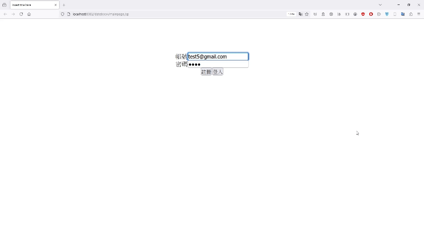
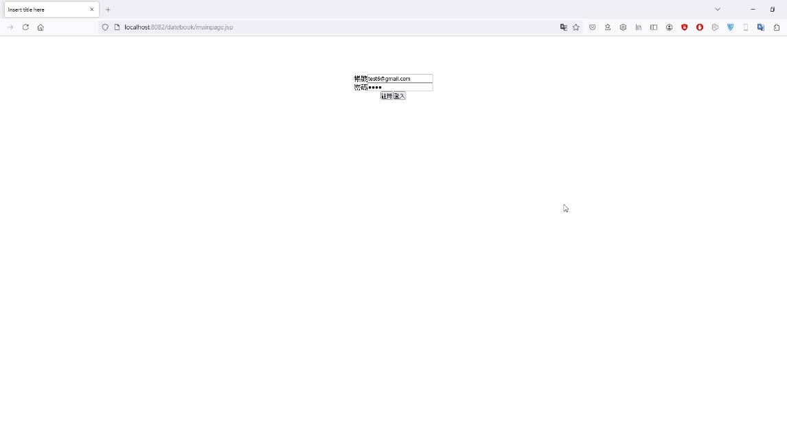
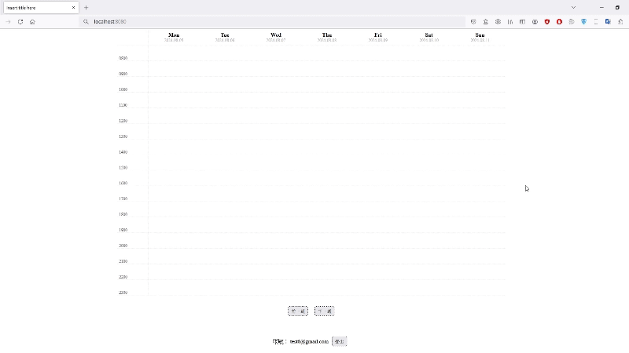
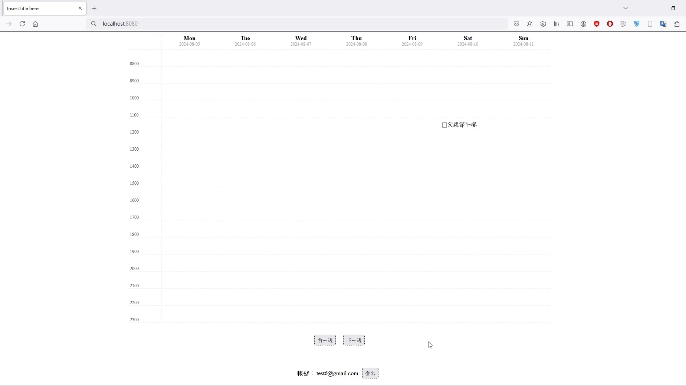
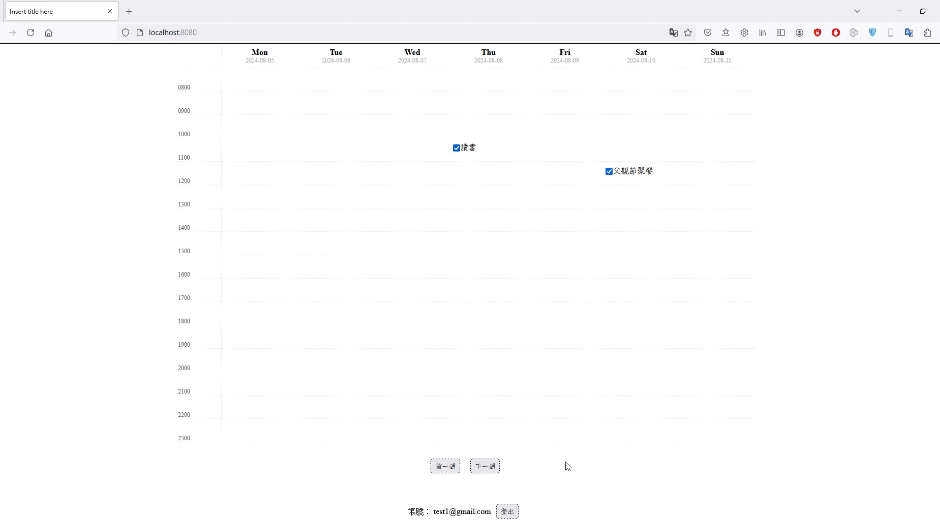
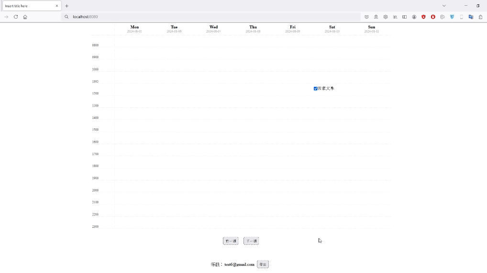
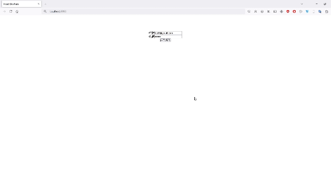
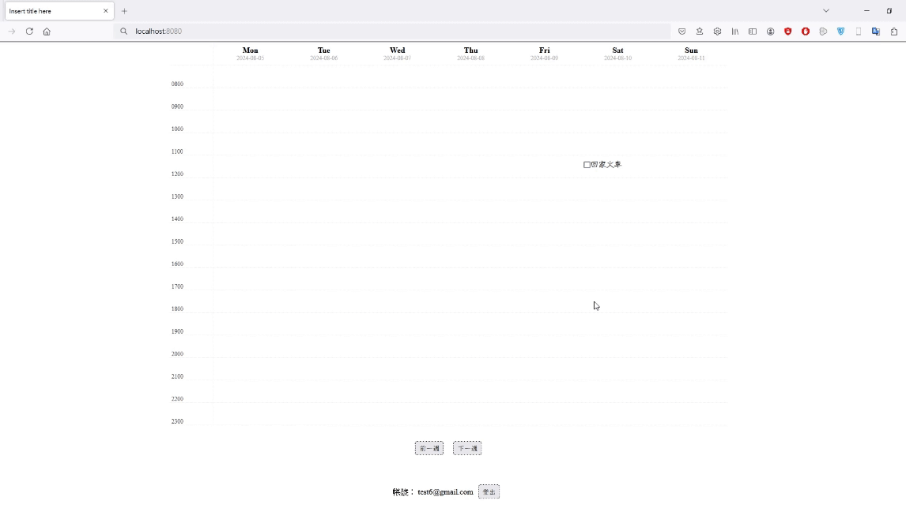

# Datebook

## About

Datebook is a simple schedule management web application that arrange schedule for seven days a week, from 8 AM to 11 PM, and displays the completion status of each task.

## Features

- Registration

   
- Login

   
- Add new events

   
- Update events
  
   
- Switch between weeks

   
- Logout

   
- Switch users
  
   
- Mark the completed events

   
